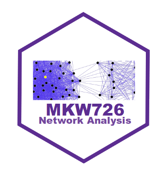

MKW726 - (Social) Network Analysis
================



HWS 2019

Preparation (before 06.09.2019)
===============================

Please install the following packages before the first session.

``` r
install.packages(c('tidyverse', 'rio', 'quanteda', 'rtweet', 
                   'topicmodels', 'stm', 'igraph', 'statnet', 
                   'intergraph'))
```

Please also install [Gephi](https://gephi.org/) on your computer.

It is better for you to create a project based on this repo:

File -&gt; New Project -&gt; Version Control -&gt; Repo URL: <https://github.com/chainsawriot/mannheim_network.git>

Organization
============

Class 1: revision of MKW 724, overview, relational data
-------------------------------------------------------

### reivision of MKW 724

-   [MKW724 Github repo](https://github.com/chainsawriot/mannheim_computational)
    -   tidyverse
    -   quanteda
    -   topic model
-   Overview: what is a graph?
    -   What can we do with a graph?
        -   (communication) power
        -   social capital
        -   information spread
        -   information source
-   Relational data
    -   representations
        -   edgelist
        -   adjacency matrix
    -   type
        -   undirected / directed
        -   unweighted / weighted
        -   multiplex / bipartite
-   Data collection
    -   Ego-Alter
    -   Affiliation
-   Assignment: group project (due next week)
    -   Collect relational data about the class.
        -   Mit wem haben Sie letzte Woche zusammen zu Mittag gegessen?
-   Reading
    -   Marin, A., & Wellman, B. (2011). Social network analysis: An introduction. The SAGE handbook of social network analysis, 11. \[[link](https://mis.csit.sci.tsu.ac.th/siraya/wp-content/uploads/2015/09/1Social-Network-Analysis-An-Introduction-1.pdf)\]

Class 2: node-level analysis / preferential attachment / network visualization / core-periphery model
-----------------------------------------------------------------------------------------------------

-   Preferential attachment
    -   Scale-free network vs Random network
        -   [Simulation](http://rocs.hu-berlin.de/interactive/pa/index.html)
    -   Centrality
        -   Degree centrality
        -   Betweenness centrality
        -   Eigenvector centrality / PageRank
    -   Core-periphery
-   Network visualization
    -   Layout algorithm
    -   Sizing
-   Assignment: Visualise the class social network. Calculate centrality.
-   Reading
    -   Barabási, A. L., & Albert, R. (1999). Emergence of scaling in random networks. science, 286(5439), 509-512. \[[link](https://arxiv.org/pdf/cond-mat/9910332.pdf%3Forigin%3Dpublication_detail)\]
    -   Barberá, P., Wang, N., Bonneau, R., Jost, J. T., Nagler, J., Tucker, J., & González-Bailón, S. (2015). The critical periphery in the growth of social protests. PloS one, 10(11), e0143611. \[[link](https://journals.plos.org/plosone/article?id=10.1371/journal.pone.0143611)\]

Class 3: graph-level analysis / community detection / homophily / social balance theory
---------------------------------------------------------------------------------------

-   Homophily
    -   Schelling model of residential dynamics
        -   how individual choices lead to global structure?
        -   [Simulation](http://nifty.stanford.edu/2014/mccown-schelling-model-segregation/)
-   Bird of a Feather Flock Together: Homophily and Community detection
    -   e.g. Walktrap
    -   Validation
-   Social balance theory
    -   Triads
    -   Closure
-   Assignment: Are there communities in the class social network?
-   Reading
    -   Adamic, L. A., & Glance, N. (2005, August). The political blogosphere and the 2004 US election: divided they blog. In Proceedings of the 3rd international workshop on Link discovery (pp. 36-43). ACM. \[[link](http://www.ramb.ethz.ch/CDstore/www2005-ws/workshop/wf10/AdamicGlanceBlogWWW.pdf)\]
    -   Khanafiah, D., & Situngkir, H. (2004). Social balance theory. arXiv preprint nlin/0405041. \[[link](https://arxiv.org/abs/nlin/0405041)\]
    -   Chan, C. H., & Fu, K. W. (2018). The “mutual ignoring” mechanism of cyberbalkanization: triangulating observational data analysis and agent-based modeling. Journal of Information Technology & Politics, 15(4), 378-387. \[[link](https://osf.io/2mv6w/)\]

Class 4: data collection / the strength of weak-ties / structral holes
----------------------------------------------------------------------

-   Data collection from survery
    -   Potential bias
        -   Recall bias
        -   Social desirability bias
-   Data collection from social media
    -   Potential bias
        -   Closed accounts
        -   Platforms intervention
-   Strong-ties / weak-ties
    -   Embeddedness
-   Assignment: ego-network of German parties on Twitter
-   Reading
    -   Liang, H., & Zhu, J. (2017). Big Data, Collection of (Social Media, Harvesting). \[[Link](https://onlinelibrary.wiley.com/doi/10.1002/9781118901731.iecrm0015)\]
    -   Granovetter, M. S. (1977). The strength of weak ties. In Social networks (pp. 347-367). \[[Link](http://bkp.pirna.com.ar/files/pirna/ARS1/ARS1-04-Granovetter-1973-The-strength-of-weak-ties.pdf)\]

Class 5: edge-level analysis / edge-betweenness / percolation / ergm
--------------------------------------------------------------------

-   Structural Bridge
    -   Edge-betweenness
-   Percolation
-   Exponential Random Graph Model
-   Reading
    -   Granovetter, M. S. (1977). The strength of weak ties. In Social networks (pp. 347-367). \[[Link](http://bkp.pirna.com.ar/files/pirna/ARS1/ARS1-04-Granovetter-1973-The-strength-of-weak-ties.pdf)\]
    -   Chwe, M. S. Y. (1999). Structure and strategy in collective action. American journal of sociology, 105(1), 128-156. \[[Link](https://www.journals.uchicago.edu/doi/pdfplus/10.1086/210269)\]

Class 6: MKW724 ∩ MKW726 / project presentation
-----------------------------------------------

-   Integration of network and text analysis
    -   Keyness of communities
    -   semantic network analysis
-   Reading
    -   Himelboim, I., McCreery, S., & Smith, M. (2013). Birds of a feather tweet together: Integrating network and content analyses to examine cross-ideology exposure on Twitter. Journal of computer-mediated communication, 18(2), 154-174. [link](https://onlinelibrary.wiley.com/doi/full/10.1111/jcc4.12001)

Class 7: (optional) project consultation
----------------------------------------
